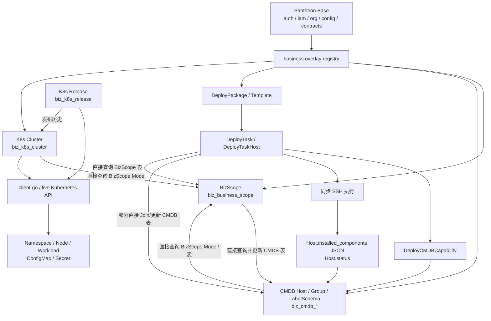
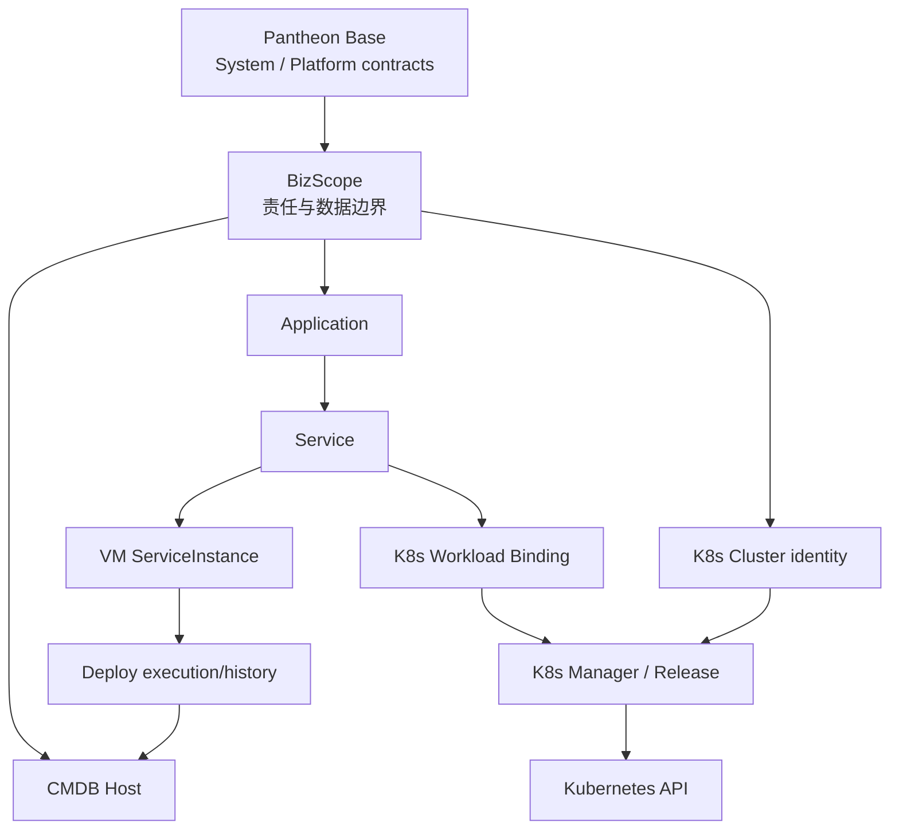

# Pantheon Ops 底座架构完整性审查

**审查时间**：2026-08-17  
**审查对象**：当前 `pantheon-ops` dirty worktree，包含尚未提交的 K8s 业务代码  
**审查范围**：`business/cmdb`、`business/bizscope`、`business/deploy`，并检查其对 K8s Manager 的支撑关系  
**审查性质**：系统级底座审查，不是普通 CRUD Code Review  
**代码变更**：本审查未修改产品代码；本文件仅为审查报告

## 1. Executive Summary

当前底座可以继续进行业务功能开发，但还不能作为生产可用的 VM 服务生命周期底座，也不应直接承载真实生产部署。

已经具备的主干包括：Host 资产登记、业务域绑定、部署包/模板/任务、SSH 安装执行、K8s Cluster 注册及实时资源操作、菜单/权限/i18n/审计框架接入。

主要阻断项：

1. 默认生产启动不会创建任何业务模块表。
2. BizScope 只是业务字段，尚未成为真实的数据授权边界。
3. 主机绑定、部署启动和组件状态回写缺少并发保护。
4. 部署包及执行依据可变，历史任务无法完整证明“当时执行了什么”。
5. 缺少 `Application / Service / ServiceInstance`，VM 生命周期无法闭环。
6. K8s 发布先修改集群、后记录审计，并且没有等待 rollout 结果。
7. 当前前端 TypeScript 检查失败。
8. 业务模块之间存在直接查询对方表/Model 的实现，违反本次确认的模块边界要求。

**是否可以继续开发**：K8s 只读和页面开发可以继续；真实 VM 部署、服务启动/停止/升级/回滚应在 P0 不变量关闭后进行。

## 2. 当前真实架构



当前实际存在的表/模型：

```text
biz_business_scope
biz_cmdb_host / biz_cmdb_group / biz_cmdb_label_schema
biz_deploy_package / biz_deploy_template / biz_deploy_template_step
biz_deploy_task / biz_deploy_task_host
biz_k8s_cluster / biz_k8s_release
```

当前没有 `Application / Service / ServiceInstance`，Deploy 和 K8s Release 之间没有共享的服务身份。

### 实现清单

| 层                         | CMDB                                     | BizScope               | Deploy                                  | K8s                               |
| -------------------------- | ---------------------------------------- | ---------------------- | --------------------------------------- | --------------------------------- |
| Model                      | Host、Group、LabelSchema                 | BizScope               | Package、Template、Step、Task、TaskHost | Cluster、Release；Node 为实时 DTO |
| Repository                 | 无独立 Repository，Service 直接使用 GORM | 同左                   | 同左                                    | 同左                              |
| Service/Handler/DTO/Router | 已实现                                   | 已实现                 | 已实现                                  | 已实现                            |
| Schema                     | AutoMigrate 模型存在                     | 同左                   | 同左                                    | 同左                              |
| 生产 Migration             | **缺失**                                 | **缺失**               | **缺失**                                | **缺失**                          |
| Frontend API/Page          | 已实现                                   | 已实现                 | 已实现                                  | 已实现但不能通过 type-check       |
| Menu/Permission/i18n       | 已实现                                   | 已实现                 | 已实现                                  | 已实现                            |
| Audit                      | CRUD 审计部分缺失                        | 已实现                 | 已实现                                  | 已实现但发布记录不可靠            |
| Test                       | 后端单测、CMDB smoke                     | 后端单测、跨模块 smoke | 后端单测、API/Page smoke                | 后端单测；无 K8s 前端 smoke       |

没有独立 Repository 本身不是缺陷，符合当前项目的轻量 Service + GORM 模式。真正的问题是跨模块直接查询对方表或 Model。

## 3. 跨模块访问边界审查

### 3.1 “禁止直接查询对方表，必须通过统一 API”是否合理

**这个要求合理，而且应该作为强制架构规则落地。** 原因不是代码风格，而是以下事实：

- 每个业务模块必须拥有自己的数据事实来源、删除语义和状态机。
- 直接查询对方表会绕过对方模块的数据权限、状态校验、审计和兼容性策略。
- 直接引用对方 GORM Model 会把数据库结构变成隐式公共 API，后续无法独立迁移或版本演进。
- 直接跨表 Join 会造成事务边界不清晰，尤其在软删除、快照和并发更新场景下容易产生脏数据。

需要区分两种“统一 API”：

1. **同一 Go 进程内**：优先使用显式的 typed capability/interface 或 application service，不必为了形式强制走 HTTP。这样可以保留同一事务、减少网络失败点，也符合当前 `DeployCMDBCapability` 模式。
2. **独立部署的服务边界**：使用版本化 REST/gRPC API，必须包含认证、数据范围、超时、重试、幂等和错误语义。

这里的“统一”是统一**调用规则、鉴权语义、DTO 和错误契约**，不是建立一个可以查询任意资源的万能 API，也不是让所有同进程调用绕一圈 HTTP。每个 provider 仍应拥有小而明确的 Reader/Command 契约。列表组合使用批量 API 或专用 read model，避免调用方为了规避直表查询而制造 N+1 请求。

该禁令应覆盖所有生产运行时代码。Versioned migration、seed、备份/恢复、离线数仓和隔离的测试 fixture 可以直接操作表，但不得被业务请求路径调用；端到端测试仍应优先通过公开 API 验证真实边界。跨模块强一致写入需要明确协调者：同进程可使用 application service + provider command；未来物理拆分后再使用 outbox/saga，不应现在就引入分布式事务框架。

因此，本项目应执行如下硬规则：

```text
业务模块只能访问自己的表。
跨模块读取必须调用 owner module 暴露的 Reader/Capability API。
跨模块写入必须调用 owner module 暴露的 Command API。
跨模块 DTO 不得复用对方 GORM Model。
所有 API 必须在 provider 侧再次执行权限和状态校验。
```

### 3.2 当前违反位置

| 调用方                | 当前实现及证据                                                                                                                                                                                                                                                                              | 违反内容                                                                  | 处理                                                                            |
| --------------------- | ------------------------------------------------------------------------------------------------------------------------------------------------------------------------------------------------------------------------------------------------------------------------------------------- | ------------------------------------------------------------------------- | ------------------------------------------------------------------------------- |
| CMDB Host             | `HostService.getBusinessScope` 直接使用 `bizscope.BizScope`；`loadHostImportScopes` 直接查询 `biz_business_scope`：[host_service.go](../backend/modules/business/cmdb/host/host_service.go#L734)、[host_import_export.go](../backend/modules/business/cmdb/host/host_import_export.go#L233) | CMDB 依赖 BizScope Model/表结构，导入路径也绕过数据授权                   | P0，改为 BizScope Reader/批量 code resolver                                     |
| BizScope              | `ListOptions`、`Get`、`Delete`、`ListBoundHosts`、`ListAvailableHosts`、`BindHosts`、`UnbindHost` 和 `scopedHostsQuery` 均直接查询/更新 `biz_cmdb_host`：[bizscope_service.go](../backend/modules/business/bizscope/bizscope_service.go#L95)                                                | BizScope 持有 CMDB 表结构并直接改变 CMDB 事实                             | P0，读改为 `CMDBHostReader`，写改为 `CMDBOwnershipCommand`                      |
| K8s Cluster           | `ClusterService.getBusinessScope` 导入并查询 `bizscope.BizScope`：[cluster_service.go](../backend/modules/business/k8s/cluster/cluster_service.go#L332)                                                                                                                                     | K8s 绕过 BizScope provider API，且只校验存在、不校验 active/可见范围      | P0，改为 `BizScopeReader.GetActive`                                             |
| Deploy → BizScope     | `resolveDeployScopeName` 直接查询 `biz_business_scope`：[deploy_service.go](../backend/modules/business/deploy/deploy_service.go#L424)                                                                                                                                                      | Deploy 绕过 BizScope owner                                                | P0，改为 `BizScopeReader.GetActive`                                             |
| Deploy → CMDB         | `taskHasVisibleTaskHost` 直接 Join `biz_cmdb_host`；`upsertHostInstalledComponent` 直接读写该表：[deploy_service.go](../backend/modules/business/deploy/deploy_service.go#L1131)、[deploy_service.go](../backend/modules/business/deploy/deploy_service.go#L1870)                           | capability 只覆盖部分路径，Deploy 仍依赖 CMDB schema 并绕过 provider 规则 | P0，补齐可见性查询和状态/投影 Command；ServiceInstance 落地后删除组件 JSON 回写 |
| Deploy → CMDB         | 已有 `DeployCMDBCapability` 用于目标解析及部分回写：[capability.go](../backend/modules/business/cmdb/capability.go#L55)                                                                                                                                                                     | 方向正确但覆盖不完整                                                      | 保留模式，缩小 DTO，补齐缺失契约                                                |
| CMDB Group/Capability | 在 CMDB bounded context 内查询 `biz_cmdb_host`                                                                                                                                                                                                                                              | 同一 owner 内部访问，不属于跨模块违规                                     | 保持内部封装，不向外暴露 GORM Model                                             |

因此，当前不是单个遗漏，而是 CMDB ↔ BizScope 双向 schema 耦合，Deploy 同时存在“正确 capability”和“绕过 capability”两条路径。这里不是普通重构建议，而是本次新增硬约束下的架构违规。

### 3.3 建议的 API 契约

由 BizScope owner 暴露：

```go
type BizScopeReader interface {
    GetVisible(ctx context.Context, id uint64, scope *common.DataScopeReq) (BizScopeRef, error)
    GetActive(ctx context.Context, id uint64, scope *common.DataScopeReq) (BizScopeRef, error)
    ResolveActiveByCodes(ctx context.Context, codes []string, scope *common.DataScopeReq) (map[string]BizScopeRef, error)
}
```

由 CMDB owner 暴露：

```go
type CMDBHostReader interface {
    ResolveDeployTargets(ctx context.Context, req ResolveTargetRequest) ([]HostTarget, error)
    ListByBusinessScope(ctx context.Context, req HostScopeQuery) (HostPage, error)
    ListAvailable(ctx context.Context, req AvailableHostQuery) (HostPage, error)
    GetOwnership(ctx context.Context, resourceID uint64, scope *common.DataScopeReq) (OwnershipRef, error)
    HasBusinessScopeReferences(ctx context.Context, businessScopeID uint64) (bool, error)
}

type CMDBOwnershipCommand interface {
    Bind(ctx context.Context, req BindOwnershipRequest) error
    Unbind(ctx context.Context, req UnbindOwnershipRequest) error
}
```

返回值应是稳定的跨模块 DTO，而不是 `BizScope`、`Host` 等 GORM Model。API 需要区分只读 Reader 和会改变事实的 Command，避免调用方通过“查询接口”修改数据。Command 的 provider 负责事务、CAS、状态机、审计和 `RowsAffected` 校验，调用方不能自行拼接 owner 表更新。

### 3.4 统一 API 规则的配套门禁

- 包级依赖检查：例如 `business/deploy` 不得 import `bizscope` 的 Model 包，不得出现 `Table("biz_business_scope")`。
- AST/静态检查：在生产运行时代码中禁止跨 bounded context 的 `TableName`、GORM Model、原始表名和 SQL Join；migration/seed/fixture 使用显式 allowlist。
- Contract test：provider 的 API DTO、错误 key、数据范围和状态语义必须有契约测试。
- Architecture test：将允许的依赖方向写成测试，而不是只写文档。
- Code review：所有跨模块数据访问必须说明 owner、API、授权、事务和失败语义。

## 4. CMDB 审查

| 项目                | 状态       | 问题                                                         | 严重程度  | 建议                                                                                     |
| ------------------- | ---------- | ------------------------------------------------------------ | --------- | ---------------------------------------------------------------------------------------- |
| Host 资产           | 已实现     | 支持 hostname/IP/OS/SSH 端口/容量/标签                       | -         | 保留                                                                                     |
| 通用资源模型        | 缺失       | 当前只能表达 Host，标签不能替代 Database/Redis/MQ 的资源身份 | P1        | 按需增加 typed resource provider，不建万能资产表                                         |
| K8s Cluster         | 部分       | Cluster 在 K8s 模块独立保存，CMDB 无统一资源视图             | P1        | 保留现表为唯一事实源，通过 capability 暴露稳定资产身份                                   |
| K8s Node/Host       | 缺失       | 没有 providerID/InternalIP 到 Host 的稳定关联                | P1        | 只存可选关联，不复制 Node 运行状态                                                       |
| SSH 凭据            | 合理       | 凭据仅存在请求内存，不持久化                                 | Won't Fix | 后续只保存凭据引用                                                                       |
| Host 生命周期       | 部分       | 状态是自由字符串，API 可任意跳转，无状态机和操作者规则       | P0        | Service 层定义转换；DB 增加约束                                                          |
| 业务域字段          | 部分       | `id/code/name` 是当前归属投影，却按快照实现；改名不会传播    | P0        | ID 为权威；名称经 BizScope Reader 解析，或由 owner command/event 维护投影，禁止跨表 Join |
| InstalledComponents | 设计不成立 | JSON 没有服务身份、端口、健康、期望状态；读改写可丢更新      | P0        | 移入 ServiceInstance                                                                     |
| 唯一性              | 部分       | `(ip, deleted_at)` 在 NULL 唯一语义下不能可靠防止并发重复    | P0        | 使用 driver 正确的有效记录唯一约束                                                       |
| Audit               | 部分       | Host/Group/Label 普通 CRUD 未设置明确审计 metadata           | P1        | 复用 base 审计能力补动作元数据                                                           |
| 前端                | 部分       | CRUD、筛选、权限、确认存在；批量删除可部分成功               | P2        | 原子批量接口或逐项结果                                                                   |

核心证据：

- Host 模型：[host_model.go](../backend/modules/business/cmdb/host/host_model.go#L10)
- 普通编辑可绑定/解绑业务域：[host_service.go](../backend/modules/business/cmdb/host/host_service.go#L235)
- 任意状态更新：[host_service.go](../backend/modules/business/cmdb/host/host_service.go#L389)
- 组件 JSON 读改写：[capability.go](../backend/modules/business/cmdb/capability.go#L124)

**这里不是代码 Bug，而是底层模型设计问题：** `installed_components` 无法充当服务实例模型。继续向 Host 增加 start/stop/health/port 字段会把 CMDB 变成服务运行数据库。

## 5. BizScope 审查

| 项目             | 状态     | 问题                                                                 | 严重程度 | 建议                                                                           |
| ---------------- | -------- | -------------------------------------------------------------------- | -------- | ------------------------------------------------------------------------------ |
| 基础字段         | 当前够用 | code/name/owner/environment/status/remark 足以登记责任域             | -        | 暂不引入 tenant/project                                                        |
| Owner            | 部分     | 只是字符串，不能参与授权、审批或通知                                 | P1       | 当前可保留；授权需要时增加 owner_user_id/成员关系                              |
| Environment      | 当前够用 | dev/test/prod 适合现阶段                                             | P2       | 暂不单独建表                                                                   |
| DataScope        | 未实现   | `List` 接收但忽略 `dataScope`，`Get` 全局读取                        | P0       | 增加 dept/ACL 并统一应用 base DataScope                                        |
| 主机绑定         | 不安全   | 不要求未绑定，覆盖其他业务域并强制 assigned                          | P0       | 由 CMDB ownership Command 在事务内条件更新 `business_scope_id=0`               |
| 并发绑定         | 不安全   | 两请求 last-writer-wins                                              | P0       | CAS/行锁并校验 RowsAffected                                                    |
| Host Update 绕过 | 存在     | CMDB 普通编辑接口也能改变业务域                                      | P0       | 归属变更只允许 CMDB owner 的 ownership Command；BizScope 只能编排调用          |
| 改名             | 不完整   | Host/Cluster 的 code/name 投影不会刷新                               | P1       | 事务传播或取消当前冗余字段                                                     |
| 删除             | 不完整   | 只检查绑定 Host，忽略 K8s Cluster/未来 Service，且检查与删除存在竞态 | P0       | 通过各 owner 的 reference API 检查；同进程用协调事务/锁或 tombstone 阻止新绑定 |
| Deploy 信任边界  | 部分     | Deploy 校验 active scope，但 scope 数据授权为空                      | P0       | RBAC + Business Scope Data Scope                                               |

核心证据：

- 数据模型无 `dept_id`/成员关系：[bizscope_model.go](../backend/modules/business/bizscope/bizscope_model.go#L9)
- 数据范围被忽略：[bizscope_service.go](../backend/modules/business/bizscope/bizscope_service.go#L45)
- 删除只检查 Host：[bizscope_service.go](../backend/modules/business/bizscope/bizscope_service.go#L191)
- 非条件批量覆盖绑定：[bizscope_service.go](../backend/modules/business/bizscope/bizscope_service.go#L307)

## 6. Deploy 审查

| 项目             | 状态   | 问题                                                                          | 严重程度  | 建议                                              |
| ---------------- | ------ | ----------------------------------------------------------------------------- | --------- | ------------------------------------------------- |
| Package 版本     | 已实现 | name/version/source/命令/模板存在                                             | -         | 保留                                              |
| Artifact 完整性  | 缺失   | 无 type、checksum/digest、provenance                                          | P1        | 增加 artifact_type、digest、source metadata       |
| Package 不可变   | 未实现 | 已被任务引用后仍可修改命令、来源和版本                                        | P0        | 发布版本不可修改，只能禁用或新建版本              |
| Task 变更记录    | 部分   | 有 scope/package/operator/time/status/result，但无 Service 身份和完整执行定义 | P0        | 引用 Service 并固化 execution snapshot            |
| Target Snapshot  | 部分   | 只在 Start 时创建 TaskHost，缺少完整连接字段                                  | P1        | submit/start 原子冻结完整目标                     |
| Package Snapshot | 不足   | Task 只保存 name/version，命令和模板仍从当前 Package 读取                     | P0        | 保存不可变执行快照                                |
| Start 幂等       | 未实现 | 先读状态再普通更新，并发调用可重复创建 TaskHost                               | P0        | 条件状态更新 + idempotency key + unique           |
| 同主机并发       | 未实现 | 无 Host/Service 执行租约                                                      | P0        | 最低限度增加 host lease                           |
| 执行方式         | 部分   | SSH 执行在 HTTP 请求内同步完成                                                | P1        | 后续使用持久 worker/reconcile                     |
| 生命周期动作     | 缺失   | 仅 install/uninstall/upgrade/reinstall                                        | P0 for VM | start/stop/health/rollback 属于 Service lifecycle |
| CMDB capability  | 合理   | Deploy 通过 capability 获取目标和回写                                         | -         | 保留并扩展                                        |
| 前端目标过滤     | 已实现 | 先选业务域，再过滤 assigned/online Host                                       | -         | 保留；后端必须重复校验                            |

核心证据：

- Package/Task/TaskHost：[deploy_model.go](../backend/modules/business/deploy/deploy_model.go#L53)
- Package 可变：[deploy_service.go](../backend/modules/business/deploy/deploy_service.go#L208)
- draft/pending 都可编辑：[deploy_service.go](../backend/modules/business/deploy/deploy_service.go#L573)
- 非原子 Start 和启动时快照：[deploy_service.go](../backend/modules/business/deploy/deploy_service.go#L807)
- CMDB 写回：[deploy_service.go](../backend/modules/business/deploy/deploy_service.go#L954)

## 7. 跨模块一致性与数据模型结论

| 关系                   | 当前情况                                                              | 风险                                                 |
| ---------------------- | --------------------------------------------------------------------- | ---------------------------------------------------- |
| CMDB ↔ BizScope        | Host 保存 id/code/name；双方都直接查询对方 Model/表，双方都可改变归属 | 双向 schema 耦合、越权、改名陈旧、并发覆盖           |
| Deploy → BizScope      | 创建任务直接查表校验 active scope                                     | 有状态校验，但绕过 owner API 且缺少 scope 级数据授权 |
| Deploy → CMDB 目标读取 | 已有 `DeployCMDBCapability`，但任务可见性仍直接 Join Host 表          | 边界只完成了一半，同一业务流存在两套规则             |
| Deploy → CMDB 状态写入 | capability 和直接 SQL 同时存在，成功后更新 Host status/组件 JSON      | 绕过 owner、Host 与服务状态混淆、JSON 并发丢更新     |
| K8s → BizScope         | Cluster 保存 scope id/name，并直接查询 BizScope Model                 | inactive/不可见 scope 可关联，改名陈旧               |
| K8s Cluster → Release  | 只有 cluster_id                                                       | 删除 Cluster 后历史发布身份不完整                    |
| Deploy/K8s             | 无共同 Application/Service 身份                                       | 无法形成统一服务视图                                 |

数据库目前没有业务表 FK。建议：

- 数据库负责 owner 表内的基础唯一性、非空、`task_id+host_id` 唯一、有效 Host IP 唯一和状态取值。
- Service 负责状态转换、active scope、数据授权、动作与目标状态匹配、快照冻结和软删除规则。
- 两边都要负责主机归属竞争、执行幂等/租约、删除引用保护和状态取值。
- 历史 Deploy/Release 快照不因业务域改名而更新；Host/Cluster 当前归属投影必须实时关联或事务更新。
- 跨模块 FK 不是禁止直表查询的替代品。若 shared DB 阶段为稳定 ID 增加 FK，它是显式的跨模块数据库契约，只保护物理引用，不能替代 provider API 的授权、软删除和状态语义；若近期计划物理拆分，则优先使用 API 校验、tombstone 和一致性对账。

## 8. VM 生命周期能力评估

| 阶段         | 结论     | 当前能力                                        |
| ------------ | -------- | ----------------------------------------------- |
| 资产登记     | 已具备   | Host CRUD、导入导出、SSH 信息采集               |
| 业务绑定     | 部分具备 | 功能存在，但授权和并发不安全                    |
| 软件包       | 部分具备 | 有版本/来源，缺少摘要、类型和不可变性           |
| 创建部署     | 部分具备 | 有 Task/Target，但无 Service 身份和完整快照     |
| 安装         | 部分具备 | SSH install 可执行，但请求耦合、无恢复          |
| 启动         | 缺失     | 无 Service start 动作/实例状态                  |
| 健康检查     | 缺失     | 无 health definition、探测和 observed state     |
| 停止         | 缺失     | 无 Service stop 动作                            |
| 升级         | 部分具备 | 有 upgrade 命令，但无版本一致性和健康门禁       |
| 回滚         | 缺失     | 无 VM rollback target/策略                      |
| 下线/Retired | 缺失     | Host 无 retired，Service 无 offline/retire 流程 |

必须增加最小的：

```text
Application
  └─ Service
       └─ ServiceInstance
            ├─ Host binding
            ├─ desired/current version
            ├─ desired/observed state
            └─ health definition/result
```

**这里不是代码 Bug，而是底层模型设计问题：** Application/Service 属于 `business/*`，不应放入 pantheon-base，也不应继续塞进 CMDB Host。

## 9. K8s 支撑能力评估

CMDB 应管理或呈现 Cluster 稳定身份、环境、业务归属、API endpoint、凭据引用和登记生命周期；可以保留可选的 Node ↔ Host 稳定关联，但不应复制 Node/Workload 的实时状态。

K8s Manager 应负责 Namespace、Node、Deployment、StatefulSet、DaemonSet、Service、ConfigMap、Secret 的实时 API 状态、Workload 操作、日志、伸缩、重启、rollout 和 Release 历史。

BizScope 应负责 Cluster 或 Namespace 的业务责任归属。当前 `Cluster.business_scope_id` 只适用于“一集群一业务域”；若支持共享集群，应增加 `(cluster_id, namespace) -> business_scope_id` 映射，不要把 Namespace 复制成 CMDB 资产。

当前问题：

- inactive BizScope 仍可被 Cluster 接受：[cluster_service.go](../backend/modules/business/k8s/cluster/cluster_service.go#L332)
- 删除 Cluster 不处理 Release：[cluster_service.go](../backend/modules/business/k8s/cluster/cluster_service.go#L192)
- Release 先修改 Workload、后写审计：[release_service.go](../backend/modules/business/k8s/release/release_service.go#L80)
- 失败审计插入错误被忽略，成功也未等待 rollout。
- Namespace/ConfigMap/Secret 修改复用宽泛的 `business:k8s:cluster:update`。
- 没有与当前实现一致的独立 K8s 设计文档，旧演进文档仍描述没有 `client-go`。

不建议把 VM Deploy 和 K8s Release 强行合并。二者应共享 Service 身份、业务归属、制品版本和审计语义，但保留不同执行器。

## 10. 软件工程最佳实践补充

### 10.1 模块化和 API 契约

- 每个 bounded context 只拥有自己的表、Model、Repository 和状态机。
- 跨模块只依赖接口/DTO，不依赖表名、GORM Model、内部 SQL 或 JSON 结构。
- Reader/Capability 只读；Command 改变事实；不要用查询接口完成隐式写入。
- 对外 REST/gRPC 必须版本化；同进程契约必须有稳定错误 key、数据范围、审计操作者和兼容性测试。
- 同进程优先 typed in-process API；独立服务才使用 REST/gRPC。
- provider API 必须提供批量读取、稳定分页和明确超时，避免用 API 边界换来 N+1 查询或无限等待。

### 10.2 数据库和迁移

- 所有生产表、索引、约束必须进入 versioned migration；AutoMigrate 只允许开发模式。
- Migration 必须确定性执行；每个变更都要有可验证的回滚或 forward-recovery 方案，并在空库、升级库和失败恢复场景验证。
- 业务唯一性不能只依赖“先查再插入”；必须有数据库约束或数据库级幂等键。
- 软删除表应明确有效记录唯一性，不能假设 `(key, deleted_at)` 在所有数据库上都等价。
- 跨模块历史记录使用快照或稳定外部标识，不依赖被删除的当前记录展示名称。

### 10.3 状态机、并发和幂等

- 状态转换必须显式列出前置状态、操作者、动作和副作用。
- 所有 Start/Retry/Callback API 必须幂等；状态更新使用条件 SQL 或乐观锁。
- 资源绑定采用事务、条件更新、唯一约束和 RowsAffected 检查。
- 同一 Host/ServiceInstance 的执行必须有 lease/lock，超时后可恢复。
- 长任务不能依赖 HTTP 请求生命周期；需要可恢复 worker、心跳和重启后的 reconciliation。

### 10.4 变更、制品和审计

- 发布后的 Package/Template/执行定义不可变；升级通过新版本产生。
- 制品必须保留类型、来源、digest/checksum、创建者和验证结果。
- Task/Release 应记录目标、版本、配置、策略、操作者、时间、结果和错误摘要。
- 审计记录不能晚于实际变更；至少先记录 pending，再记录 apply/success/failed。
- K8s 变更必须以 rollout/健康结果决定最终状态，不能以 API update 成功代替发布成功。

### 10.5 安全和权限

- RBAC 解决“能否执行动作”，Business Scope Data Scope 解决“能操作哪些数据”。
- 前端按钮权限只是 UX，后端 provider 必须再次验证。
- Secret 只能通过 base 的安全能力或引用访问，不进入 CMDB/Deploy 普通 DTO。
- Cluster、Namespace、Workload、Host 的授权范围必须可审计、可测试、可回放。

### 10.6 测试和质量门禁

最低门禁应包含：

```text
go test ./...
go test -race ./...
go vet ./...
npm run type-check
架构依赖检查
空库 migration smoke
跨模块 API contract test
BizScope → CMDB → Deploy E2E smoke
K8s release/rollback/rollout failure smoke
```

必须优先测试不变量，而不是只测试 CRUD：并发绑定、越权 scope、重复 Start、重复 callback、不可变快照、状态非法转换、删除引用、审计写入失败和进程重启恢复。

### 10.7 可观测性和运维性

- 每个部署/发布都要有 correlation ID、task ID、service instance ID 和 operator。
- 记录开始、排队、执行、重试、完成、超时和恢复事件。
- SSH/K8s 操作设置明确 timeout、retry/backoff、并发上限和取消语义。
- 任务状态必须能从数据库、执行器和资源 observed state 三处对账。
- 失败必须可重试、可人工接管，不能只留下 running 状态。

### 10.8 外部依据与版本边界

以下资料用于支撑工程实践判断，不改变“当前代码事实”和“建议方案”的边界：

- [Microsoft - Data sovereignty per microservice](https://learn.microsoft.com/en-us/dotnet/architecture/microservices/architect-microservice-container-applications/data-sovereignty-per-microservice)：服务拥有自己的数据，其他模块通过 API/消息访问；支撑禁止运行时代码直查对方表。
- [Microsoft - Cloud-native communication patterns](https://learn.microsoft.com/en-us/dotnet/architecture/cloud-native/communication-patterns)：区分同进程方法调用与跨进程网络调用；支撑同进程 typed capability、跨进程 REST/gRPC 的边界判断。该“typed API”表述是基于官方通信边界的工程推导，不是原文术语。
- [MySQL 8.0 - Constraints](https://dev.mysql.com/doc/refman/8.0/en/constraints.html) 和 [Foreign Key Constraints](https://dev.mysql.com/doc/refman/8.0/en/create-table-foreign-keys.html)：约束用于表达 `UNIQUE`、`CHECK`、主键和外键等写入不变量。
- [MySQL 8.0 - Locking Reads](https://dev.mysql.com/doc/refman/8.0/en/innodb-locking-reads.html) 与 [Transaction Isolation Levels](https://dev.mysql.com/doc/refman/8.0/en/innodb-transaction-isolation-levels.html)：支撑绑定、租约和条件更新需要事务/锁，而不是“先查再写”。
- [MySQL 8.0 - InnoDB Online DDL](https://dev.mysql.com/doc/refman/8.0/en/innodb-online-ddl-operations.html)：支撑 migration 需要评估锁、重建表和验证成本。
- [RFC 9110 - HTTP Semantics](https://www.rfc-editor.org/rfc/rfc9110.html)：定义 HTTP 幂等语义；对于命令型 `POST`，报告建议显式幂等键和服务端去重。
- [Kubernetes - Controllers](https://kubernetes.io/docs/concepts/architecture/controller/)、[Objects](https://kubernetes.io/docs/concepts/overview/working-with-objects/) 和 [Deployments](https://kubernetes.io/docs/concepts/workloads/controllers/deployment/)：支撑以 `spec/status`、conditions 和 rollout 结果判断发布完成，而不是以 API update 成功代替健康结果。
- [OWASP Authorization Cheat Sheet](https://cheatsheetseries.owasp.org/cheatsheets/Authorization_Cheat_Sheet.html)：支撑默认拒绝、最小权限、逐请求服务端鉴权和授权测试。

版本上下文：当前仓库使用 MySQL（`docker-compose.yml:3` 为 `mysql:8.0`，Go 驱动为 `gorm.io/driver/mysql`），所以数据库建议按 MySQL/InnoDB 语义验证；Kubernetes 与 Microsoft 页面是持续维护的官方文档，具体版本上线前仍需按目标版本复核。

## 11. P0 / P1 / P2 / Won't Fix

### P0：必须修

1. 所有跨模块表/Model 访问改为 owner module Reader/Command API，并加入架构门禁。
2. 补齐 BizScope/CMDB/Deploy/K8s 版本化生产 migration。
3. 将 BizScope 落实为数据授权边界；禁止 CMDB 普通 Update 绕过 ownership Command。
4. 主机绑定使用事务/CAS，禁止覆盖已归属 Host。
5. 冻结 Package/Task 执行意图，保证 Start 幂等，增加 TaskHost unique 和执行 lease。
6. 引入最小 Application/Service/ServiceInstance 后再实现 start/stop/health/rollback。
7. 建立合法 Host/Service 状态机，停止用组件数量推导 Host online/offline。
8. K8s Release 先建立 pending 审计，再修改 Workload，并等待 rollout。
9. 修复前端 TypeScript 检查失败。

### P1：应该修

- artifact type、digest/checksum、provenance。
- 可恢复 worker/reconciliation。
- scope/cluster 当前名称投影同步。
- CMDB CRUD 审计 metadata。
- K8s Namespace 级归属和细粒度权限。
- 软删除有效唯一索引、owner 表内必要 FK/索引，以及通过 provider API 完成的跨模块删除引用检查。
- 并发、幂等、rollout 失败和 API contract 测试。
- 与现状一致的 K8s 设计文档。

### P2：可以后续优化

- 批量删除体验、错误反馈和 K8s 下拉加载错误处理。
- 统一分页/filter/error DTO 细节。
- 前端组件测试、视觉回归和列表性能。

### Won't Fix

- 不把所有 Kubernetes 对象复制进 CMDB。
- 不提前引入 tenant/project/复杂环境模型。
- 不持久化 SSH 密码或私钥。
- 不为风格原因引入 Repository、DDD、CQRS 或事件溯源。
- 不复制 pantheon-base 的 IAM、审计、菜单、i18n 能力。
- 不立即迁移 `biz_k8s_cluster` 表；先通过 API/Capability 接入资源视图。

## 12. 最小增量修改方案

### 目标架构



图中的箭头表示业务关系和依赖方向，不表示允许直查对方表；跨模块数据访问统一经过第 3.3 节的 owner API/Capability。

| Step | 涉及文件/模块                                                                                                                                                                                    | 修改内容及原因                                                                                                             | DB                        | API/Capability                                                             | Frontend                                     | Test                                                          |
| ---- | ------------------------------------------------------------------------------------------------------------------------------------------------------------------------------------------------ | -------------------------------------------------------------------------------------------------------------------------- | ------------------------- | -------------------------------------------------------------------------- | -------------------------------------------- | ------------------------------------------------------------- |
| 1    | `backend/modules/business/{bizscope,cmdb,deploy,k8s}`；`backend/pkg/database/migrations/*.sql`                                                                                                   | 为全部业务表、索引和有效唯一性增加 versioned migration；默认生产启动不能依赖 AutoMigrate                                   | 是                        | 启动失败保持 base 统一错误路径                                             | 否                                           | 空库、已有库升级、重复执行、失败恢复 smoke                    |
| 2    | `bizscope/bizscope_service.go`、`cmdb/host/host_service.go`、`cmdb/host/host_import_export.go`、`deploy/deploy_service.go`、`k8s/cluster/cluster_service.go`；各 owner 新增/扩展 `capability.go` | 移除第 3.2 节全部跨模块 Model/表访问；统一为 provider-owned typed Reader/Command，同时保持外部 HTTP 路由不变               | 否                        | 新增 `BizScopeReader`、`CMDBHostReader`、`CMDBOwnershipCommand` 及批量 DTO | 原则上无；现有页面 API 不变                  | architecture test、provider contract、调用方 mock、跨模块 E2E |
| 3    | `bizscope/bizscope_service.go`、`cmdb/host/host_service.go`、`cmdb/capability.go`、相关 handler/DTO                                                                                              | 落实 BizScope DataScope；CMDB 成为 Host ownership 唯一写入口；绑定使用事务/CAS，删除使用 reference API + 防竞态机制        | 可能增加 ACL/版本列和索引 | ownership Command、reference Reader                                        | 选择器只展示授权 scope/Host；冲突错误可见    | 并发绑定、越权、删除并发、改名/解绑                           |
| 4    | `deploy/deploy_model.go`、`deploy/deploy_service.go`、`cmdb/capability.go`                                                                                                                       | 冻结 execution/target/package snapshot；Package 发布后不可变；Start 条件更新、幂等键、TaskHost unique、Host/Instance lease | 是                        | `Start` 返回稳定 task/idempotency 结果                                     | 展示冻结版本、执行状态和冲突原因             | 并发 Start、重复 callback、lease 超时、重启恢复               |
| 5    | 建议新增 `backend/modules/business/service/`；修改 overlay registry、Deploy DTO/Model                                                                                                            | 增加最小 Application/Service/ServiceInstance，建立 VM 与 K8s 的共同服务身份；避免继续扩展 `Host.installed_components`      | 是                        | Task 必须引用 service/instance；提供实例状态/健康 Reader                   | 增加服务和实例选择/详情，不新建营销式页面    | BizScope → CMDB → Service → Deploy 完整链路                   |
| 6    | `cmdb/host/host_service.go`、新增 service state service、`deploy/deploy_service.go`                                                                                                              | 分离 Host 资产状态与 ServiceInstance desired/observed/health 状态；所有转换显式校验                                        | 是                        | Deploy 只通过 ServiceInstance Command 回写服务状态                         | 资源状态与服务状态分开展示                   | 非法转换、乱序 callback、并发回写、回滚                       |
| 7    | `k8s/release/release_service.go`、`k8s/cluster/cluster_service.go`、权限 seed/i18n/前端 K8s 页面                                                                                                 | Release 先写 pending，再 apply 并等待 rollout；Cluster 删除保护；共享集群再增加 Namespace ownership                        | 少量                      | Release 状态和 Namespace ownership capability                              | 细粒度按钮权限、rollout/失败状态             | apply/rollout/审计失败、超时、删除引用                        |
| 8    | `frontend/src/modules/business/k8s/*`、建议新增 architecture checker/contract smoke                                                                                                              | 修复现有 TypeScript 错误；把直表禁令、type-check、migration 和跨模块 smoke 变成持续门禁                                    | 否                        | 更新 capability/API 契约文档                                               | type-check、API/Page smoke；视觉验收另行执行 | Go test/race/vet、npm type-check、architecture/contract smoke |

以上均为后续实施建议，本次审查没有创建这些接口、表或文件。

## 13. 最终结论与完成度

评分采用各章节检查项归一化：已具备=1、部分具备=0.5、缺失或被 P0 阻断=0；Overall 为六项等权均值四舍五入。检查项来自本报告的模型、生命周期、授权、一致性、API、前端、迁移和测试条目，不以代码行数计分。

| 模块            |                 计分基数 |  完成度 | 已具备                                         | 主要缺失/风险                                                               |
| --------------- | -----------------------: | ------: | ---------------------------------------------- | --------------------------------------------------------------------------- |
| CMDB            | 12 项：4 已具备 + 4 部分 | **50%** | Host CRUD、标签、分组、采集、DataScope 接口    | 仅 Host、无状态机、组件 JSON、生产迁移/并发唯一性、直查 BizScope            |
| BizScope        | 12 项：3 已具备 + 4 部分 | **42%** | CRUD、绑定 UI、基础责任域模型                  | 数据授权为空、直查 CMDB、绑定覆盖、删除/改名一致性                          |
| Deploy          | 14 项：4 已具备 + 6 部分 | **50%** | Package/Template/Task、SSH、主机结果、审计骨架 | 不可变快照、幂等、并发租约、持久执行、服务身份、直表旁路                    |
| VM Lifecycle    | 11 项：1 已具备 + 5 部分 | **32%** | 资产登记                                       | 绑定/包/部署/安装/升级仅部分，start/stop/health/rollback/service state 缺失 |
| K8s Integration | 10 项：4 已具备 + 3 部分 | **55%** | Cluster、实时 API、Workload 操作、Release 骨架 | CMDB 接入、Namespace 归属、可靠审计/rollout、前端门禁、直查 BizScope        |
| Engineering     | 12 项：4 已具备 + 4 部分 | **50%** | 注册、权限声明、i18n、后端测试、smoke 基础     | 生产迁移缺失、前端编译失败、并发/架构/跨模块契约测试缺失                    |
| **Overall**     |  `(50+42+50+32+55+50)/6` | **47%** | 已形成业务模块骨架                             | 尚未达到生产生命周期底座标准                                                |

### A. 现在能不能继续开发？

可以分轨继续：K8s 只读和页面开发可以继续；真实部署和 VM 生命周期动作应等待 P0 不变量关闭。

### B. 哪些问题必须先修？

跨模块 API 边界、生产 migration、BizScope 数据权限和绑定并发、Deploy 不可变快照及幂等、ServiceInstance 模型、K8s 发布审计、前端编译。

### C. 哪些可以边开发边修？

制品类型扩展、持久 worker、Namespace 细粒度授权、UI 批处理体验、错误语义和设计文档。

### D. 当前底座是否足以支撑 VM Service Lifecycle + Kubernetes Management？

- **VM Service Lifecycle：不足**，当前只能支撑资产登记和安装类 POC。
- **Kubernetes Management：部分足够**，资源管理主体合理，但尚不满足生产发布和业务授权要求。

### E. 一周内最应该做的 5 件事

1. 补齐全部业务表的生产 migration，并加入空库/升级库验证。
2. 建立 BizScope/CMDB owner API，移除第 3.2 节全部跨模块直表/Model 访问并加架构门禁。
3. 修复 BizScope DataScope、CMDB ownership 事务/CAS 和删除竞态。
4. 完成 Deploy Start 原子化、执行快照、幂等、TaskHost unique 和执行 lease。
5. 固化最小 ServiceInstance 契约，同时修复 K8s Release 审计/rollout 与现有前端 type-check 红灯。

## 14. 验证证据和残余风险

- `go test -count=1 ./modules/business/...`：通过。
- `npm run type-check`：失败，存在 5 个 K8s 前端错误：`ClusterList.tsx:219`、`ReleaseList.tsx:15/186`、`WorkloadList.tsx:14/231`。
- 已检查菜单、组件注册、权限 seed、i18n、数据库 AutoMigrate、后端路由、前端 API/Page、smoke 和设计文档。
- 未运行视觉回归，因此 UI 结论仅基于源码，不声称完成渲染质量验收。
- 本报告建议的新增 API、migration、Service 模型和架构 checker 均为建议，不代表当前代码已经存在。

## 15. 后续开发任务与无记忆交接

本审查已拆分为可由不同工具、不同成本模型独立接手的 L2 任务计划：

- 总任务：`docs/harness/tasks/2026-08-17-ops-foundation-hardening.task.md`
- 无记忆入口：`.harness/tasks/2026-08-17-ops-foundation-hardening/HANDOFF.md`
- 机器清单：`.harness/tasks/2026-08-17-ops-foundation-hardening/manifest.json`
- 执行状态：`.harness/tasks/2026-08-17-ops-foundation-hardening/STATUS.md`

执行者不得仅凭本报告直接改代码。必须选择依赖已完成的子任务，先按其
`HANDOFF.md` 重新验证当前代码和脏工作区，再把实现进度、决策、验证证据和
下一原子动作写入该任务的 `STATUS.md`。高风险事务、授权、状态机和 migration
由单一强模型负责；契约冻结后的独立测试、门禁、文档和局部前端修复可以交给
低成本模型，最终仍需强模型按证据复核。
