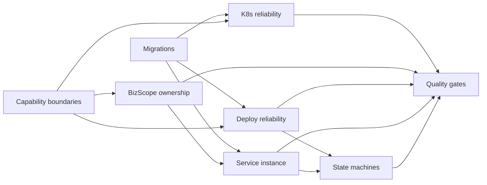

# Pantheon Ops Foundation Hardening Program

Task ID: `2026-08-17-ops-foundation-hardening`  
Priority: P0/P1 program  
Delivery tier: L2  
Repository: `pantheon-ops`  
Owner boundary: `business/*` only

## Goal

Turn the current CMDB, BizScope, Deploy, and K8s business modules into a safe
foundation for VM service lifecycle and production Kubernetes operations without
copying `pantheon-base` capabilities or redesigning the whole repository.

The governing invariants are:

1. A business module accesses only tables it owns.
2. Cross-module reads use provider-owned typed Reader/Capability APIs.
3. Cross-module writes use provider-owned Command APIs.
4. BizScope is enforced as a server-side data authorization boundary.
5. CMDB owns resource facts and ownership writes; Deploy owns change intent and
   execution history; ServiceInstance owns service desired/observed state.
6. Production schema changes are versioned, repeatable, and tested.
7. Deploy and K8s mutations are immutable, idempotent, auditable, and recoverable.

## Sources Of Truth

Read in this order:

1. `AGENTS.md`
2. `docs/PROJECT_INHERITANCE.md`
3. `docs/business-module-review-summary.md`
4. This program packet
5. The selected child task packet and its `.harness/tasks/<task-id>/HANDOFF.md`
6. Relevant design files under `docs/designs/`
7. Current code and tests; code is authoritative when it changed after the audit

## Program Scope

In scope:

- versioned migrations for business-owned tables and constraints;
- provider-owned cross-module contracts and removal of runtime direct-table access;
- BizScope data scope and CMDB ownership concurrency rules;
- Deploy immutability, snapshots, idempotency, and execution leases;
- the minimum Application/Service/ServiceInstance foundation;
- explicit resource and service lifecycle state machines;
- K8s release audit/rollout reliability and cluster reference protection;
- architecture, contract, migration, backend, frontend, and smoke gates.

Out of scope:

- changes to `pantheon-base` unless a new task explicitly proves shared ownership;
- copying platform/system IAM, audit, menu, i18n, secret, or migration frameworks;
- storing all Kubernetes API objects in CMDB;
- merging VM Deploy and K8s Release into one executor;
- tenant/project hierarchies, CQRS, event sourcing, or premature microservices;
- persistent SSH passwords/private keys;
- unrelated cleanup in the existing dirty worktree.

## Child Tasks

| Order | Task ID                                  | Priority              | Primary outcome                                                     |
| ----: | ---------------------------------------- | --------------------- | ------------------------------------------------------------------- |
|     1 | `ops-business-versioned-migrations`      | P0                    | Business schema is reproducible without production AutoMigrate      |
|     2 | `ops-cross-module-capability-boundaries` | P0                    | All runtime cross-module access uses owner APIs                     |
|     3 | `ops-bizscope-datascope-ownership`       | P0                    | Scope authorization and host ownership are race-safe                |
|     4 | `ops-deploy-immutability-idempotency`    | P0                    | A deployment is a frozen, idempotent change record                  |
|     5 | `ops-service-instance-foundation`        | P0 design/P1 delivery | VM and K8s have a common service identity                           |
|     6 | `ops-resource-service-state-machines`    | P0 for VM lifecycle   | Host and service states have separate legal transitions             |
|     7 | `ops-k8s-release-reliability`            | P0                    | Release records exist before mutation and reflect rollout outcome   |
|     8 | `ops-architecture-quality-gates`         | P0/P1 closeout        | Boundary, migration, compile, contract, and E2E regressions fail CI |

## Dependency Graph

`Migrations` and `Capability boundaries` may start in parallel. Capability
contracts must merge before, or atomically with, callers that depend on them.
`Service instance` may begin contract/design work after BizScope ownership is
stable, but schema implementation also depends on migrations. State machines
start only after Deploy and ServiceInstance contracts are frozen.

## Execution Batches And Cost Allocation

| Batch | Parallel-safe lanes                                      | Executor recommendation              | Reason                                                |
| ----- | -------------------------------------------------------- | ------------------------------------ | ----------------------------------------------------- |
| A     | migrations; capability contract design                   | strong model, separate owners        | schema and dependency direction are high blast radius |
| B     | BizScope ownership; Deploy reliability; K8s reliability  | strong model per lane                | transaction, authorization, and external side effects |
| C     | ServiceInstance foundation                               | architect/strong model, single owner | new bounded context and shared identity contract      |
| D     | state machines                                           | strong model, single owner           | ordering, retries, and cross-state invariants         |
| E     | quality gates, isolated tests, docs, frontend type fixes | lower-cost models with exact packets | bounded outputs and deterministic verification        |

Do not let multiple tools edit the same service/model/migration sequence in
parallel. Lower-cost models may add test cases after the owning implementation
contract is frozen, but the implementation owner reviews and integrates them.

## Program Acceptance Criteria

- Every child task reaches `complete` with evidence, or is explicitly deferred
  with a maintainer-approved reason and dependency impact.
- Production runtime paths contain no cross-module table names, SQL joins, or
  foreign GORM models outside allowlisted migrations/seeds/fixtures.
- Empty database and representative upgrade database migrations pass.
- BizScope authorization, host ownership CAS, Deploy duplicate Start, lease,
  immutable snapshot, state transition, and K8s rollout failure tests pass.
- `go test -count=1 ./modules/business/...`, `go test -race ./modules/business/...`,
  `go vet ./...`, and `npm run type-check` pass from their documented workdirs.
- BizScope -> CMDB -> Service -> Deploy and BizScope -> K8s Release smoke evidence
  exists, including denied-scope cases.
- UI-changing tasks include rendered desktop/mobile evidence or an explicit,
  reviewed runtime gap. Source review alone cannot claim UI completion.
- No `pantheon-base` or inherited `system/platform` behavior is locally copied.

## Maintainer Gates

Stop and request one consolidated decision when any of these occurs:

- a required fix is actually owned by `pantheon-base`;
- a task needs to change the foundation version or inherited system/platform files;
- a migration would drop data, cannot roll forward safely, or needs a production
  outage decision;
- two task owners propose incompatible public DTO/state contracts;
- authorization behavior cannot be derived from existing base DataScope contracts;
- the dirty worktree contains overlapping, unowned edits that cannot be preserved.

## Evidence

Program evidence root: `.harness/evidence/2026-08-17-ops-foundation-hardening/`.
Each child writes only to `.harness/evidence/<task-id>/` and records command,
review, migration/runtime, and residual-risk evidence in its manifest.
